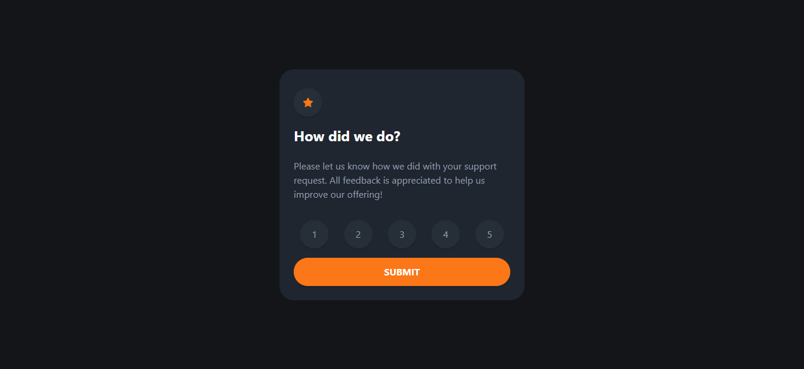
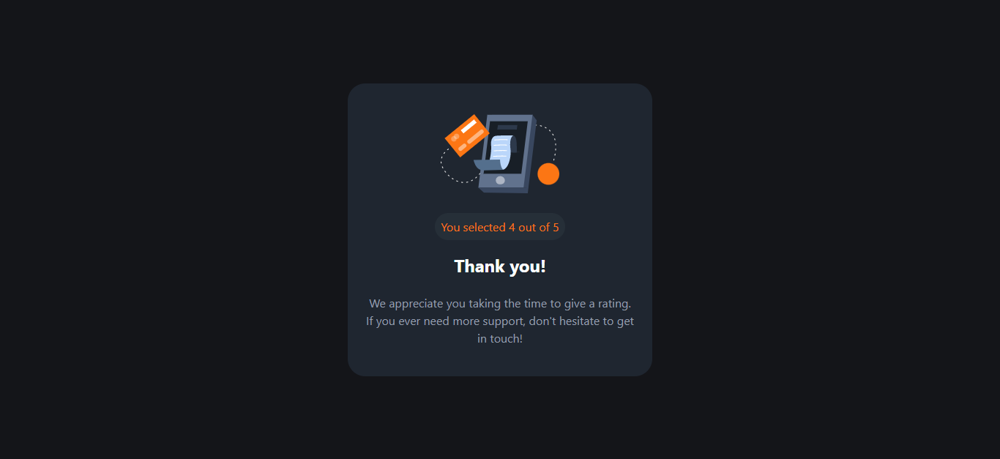

# Frontend Mentor - Interactive rating component solution

This is a solution to the [Interactive rating component challenge on Frontend Mentor](https://www.frontendmentor.io/challenges/interactive-rating-component-koxpeBUmI).

  ## Table of contents

  - [Overview](#overview)
  - [Screenshot](#screenshot)
  - [Built with](#built-with)
  - [What I learned](#what-i-learned)
  - [Useful resources](#useful-resources)

## Overview

### Screenshot

### Links

- Solution URL: [gitub repo](https://github.com/Schismond/interactive-rating)
- Live Site URL: [gitub pages](https://schismond.github.io/interactive-rating)

## My process

Analyze the layout and structure of the webpage.
Create the HTML skeleton of the webpage.
Add content to the webpage using HTML tags.
Add images and media files to the webpage.
Style the webpage using Tailwindcss classes.
Test the webpage on different browsers and devices to ensure it's responsive and functional.
Make necessary adjustments and improvements to the webpage based on the testing results.

### Built with

- Semantic HTML5 markup
- CSS custom properties
- Flexbox
- CSS Grid
- Mobile-first workflow
- [Tailwind](https://tailwindcss.com) - CSS framework

### What I learned

During the Interactive Rating Component challenge on Frontend Mentor, I learned a great deal about building dynamic and engaging user interfaces. The challenge involved creating a rating component that allowed users to interactively rate a product or service. Through this project, I honed my skills in HTML, CSS, and JavaScript, gaining a deeper understanding of event handling, DOM manipulation, and CSS styling. I also learned how to incorporate interactive features such as hover effects, click events, and dynamic content updates. This challenge pushed me to think creatively and problem-solve, ensuring a seamless and intuitive user experience. Overall, the Interactive Rating Component challenge provided me with valuable hands-on experience and enhanced my frontend development skills.

### Useful resources

- [Tailwindcss documentation](https://tailwindcss.com) - This helped me to quickly find the informations I needed , it's quick and easy an efficient
